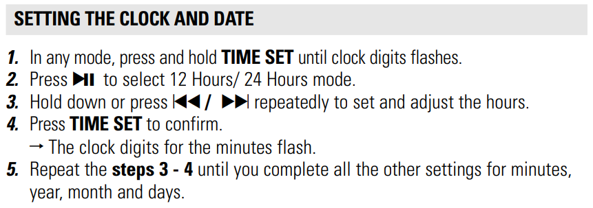
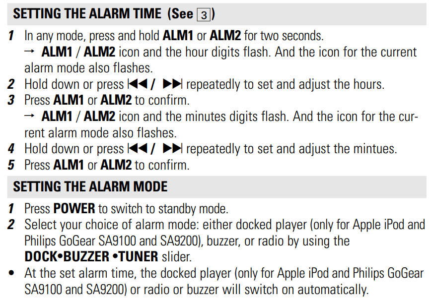
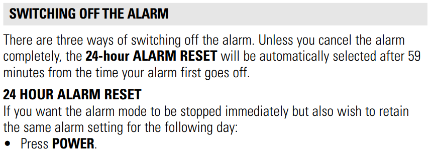
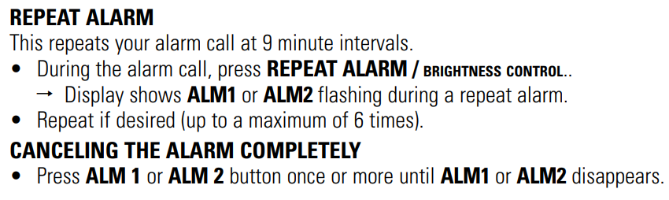
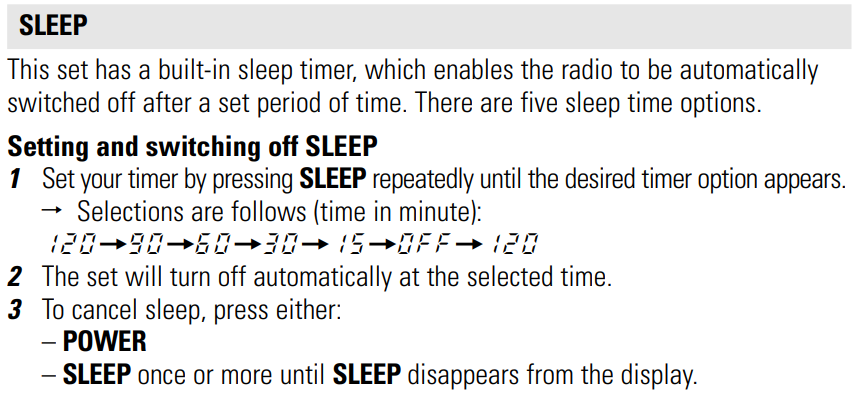

# PhilipsAJ300D_Manual
Hosting the manual for this clock radio as I don't trust Philips to keep it on their website forever!

Click [here](https://raw.githubusercontent.com/2cjenn/PhilipsAJ300D_Manual/refs/heads/main/ClockRadioManual.pdf) to download the full manual or view it in this repo.

I've put the excerpts I think are most useful below.

# Set Time

# Set Alarm

## WARNING

The clock radio has a backup battery, so if there's a brief powercut it should retain the time and alarm times that you set.

**HOWEVER** - if the alarm was set, it will still look like it's set, but no longer actually go off!

You will need to unset and then reset the alarm.

(At least, I remember this being the case, but it's been a few years so I might be hazy on the details!)

# Turn off Alarm

# Play until you go to sleep

